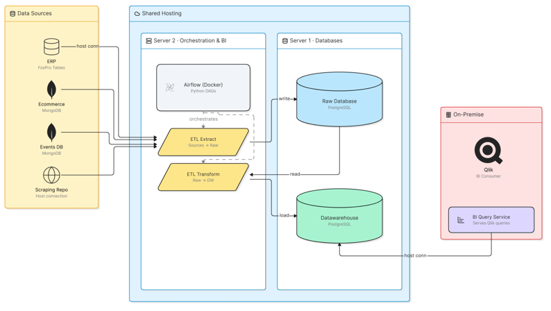
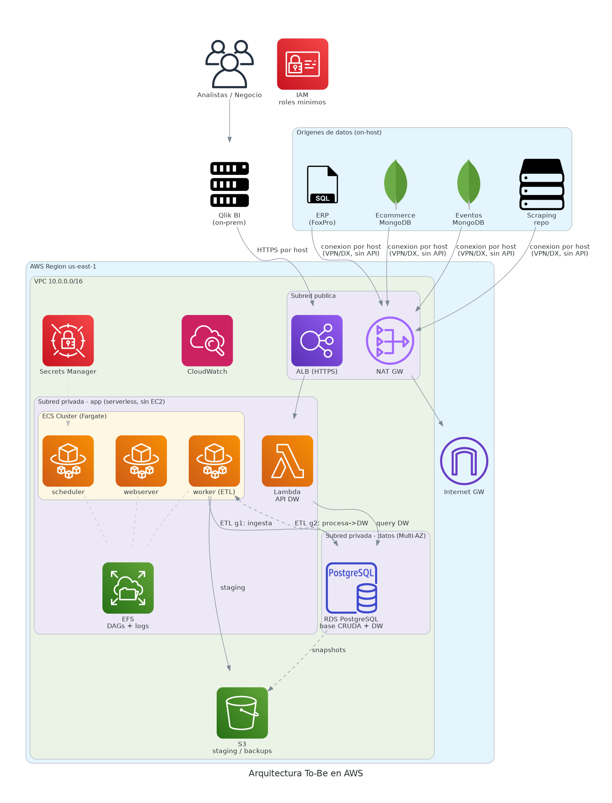
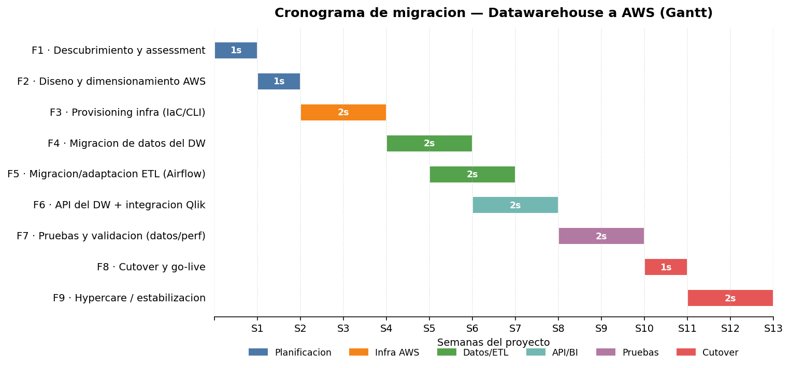

# Plan de Migración a la Nube — Datawarehouse → AWS

> Trabajo Integrador · Cloud Computing (AWS)
> **Escala:** PyME · **Región:** `us-east-1` · **Motor DW:** PostgreSQL · **Fecha:** Julio 2026


---

## Contenido

- [1. Resumen ejecutivo](#1-resumen-ejecutivo)
- [2. Objetivo](#2-objetivo)
- [3. Situación actual (As-Is)](#3-situación-actual-as-is)
- [4. Arquitectura objetivo (To-Be)](#4-arquitectura-objetivo-to-be)
- [5. Justificación de la arquitectura](#5-justificación-de-la-arquitectura)
- [6. Cronograma (Gantt)](#6-cronograma-y-estimación-de-tiempos-gantt)
- [7. Costos y presupuesto AWS](#7-costos-y-presupuesto-aws)
- [8. Runbook de implementación](#8-runbook-de-implementación)
- [9. Servicios AWS utilizados](#9-servicios-aws-utilizados)
- [Estructura del repositorio](#estructura-del-repositorio)

---

## 1. Resumen ejecutivo

Este plan detalla la migración de la base de datos **Datawarehouse (DW)** de la empresa, hoy alojada en un servidor de hosting compartido, hacia una arquitectura gestionada y de alta disponibilidad en AWS.

El DW se alimenta mediante ETL escritos en **Python** que corren sobre **Airflow dockerizado**, con información desde cuatro orígenes:

- **ERP** — Tablas FoxPro
- **Ecommerce** — MongoDB
- **Base de eventos** — MongoDB
- **Scraping** — Repositorio en formato CSV

La herramienta de **BI (Qlik)**, desde un servidor on-premise, consume el DW. Las conexiones a las bases de datos desde los ETL son todas por conexión directa (por host, no por API).

## 2. Objetivo

Migrar una infraestructura con mucha **deuda técnica** y alto grado de administración manual hacia una infraestructura **administrada**, con menor atomicidad, mayor seguridad en las integraciones y que ofrezca **alta disponibilidad**.

### Objetivos SMART

| Objetivo SMART | Métrica / meta |
|---|---|
| Alta disponibilidad del DW | RDS Multi-AZ con failover automático; **RPO ≤ 5 min, RTO ≤ 30 min** |
| Separar cómputo de datos | ETL en ECS Fargate; Bronce y DW en RDS, en subredes privadas distintas |
| Seguridad de credenciales | 100% de las credenciales en Secrets Manager; **0 secretos en disco** |
| Infra reproducible | Levantar ≥4 servicios con un comando (script AWS CLI / IaC) |
| Costo bajo control | **≤ USD 300/mes**, con alerta de AWS Budgets al 80% |
| Plazo de migración | Go-live en ≤ 14 semanas, con hypercare posterior |

## 3. Situación actual (As-Is)

Toda la operación analítica vive en **dos servidores de un hosting compartido**. Uno concentra la información cruda en PostgreSQL y, al mismo tiempo, el Datawarehouse en PostgreSQL. El otro ejecuta el orquestador **Airflow** (dockerizado, con DAGs Python) y sirve las consultas de BI.

Los ETL extraen datos de los cuatro orígenes mediante **conexión directa por host** —no por API—. Esos datos se guardan en la base "cruda" y luego un segundo grupo de ETL los procesa para enviarlos al DW. **Qlik**, desde on-premise, lee el DW de la misma forma: conexión por host, sin capa de servicio intermedia.

Originalmente la BI era solo para indicadores gerenciales de seguimiento, sin peso en la toma de decisiones. Hoy es una **herramienta crítica** para el negocio: una caída del servicio puede comprometer la toma de decisiones.



> *Figura 1 — Arquitectura actual (as-is).*

### 3.1 Problemas y puntos únicos de falla

- **Carga administrativa** de mantener y monitorear el fierro, con un equipo de IT chico.
- **Sin redundancia:** dos servidores sin réplica; la caída del servidor de datos deja sin base cruda y sin DW a la vez. Restauración solo por snapshot.
- **Base cruda y DW en el mismo servidor:** un pico de ingesta o de consultas compite por los mismos recursos de disco y CPU.
- **PostgreSQL sin alta disponibilidad:** una falla de disco o del nodo implica pérdida o indisponibilidad de datos.
- **Backups no gestionados:** manuales, lentos y sin garantía de punto de restauración.
- **Credenciales de los orígenes en el propio servidor**, sin gestor de secretos.
- **Configuración manual no versionada:** el entorno no es reproducible.
- **Escala fija del hosting:** no absorbe picos de carga de ETL ni de consultas de BI.

## 4. Arquitectura objetivo (To-Be)

La solución se despliega en una **VPC dedicada (`10.0.0.0/16`)**, con arquitectura de **tres capas**, cómputo serverless y separación de responsabilidades por subred.



> *Figura 2 — Arquitectura to-be en AWS.*

### 4.1 Componentes

| Capa | Servicio AWS | Rol en la solución |
|---|---|---|
| Red | VPC + subredes | VPC `10.0.0.0/16`; subred pública (ALB, NAT) y subredes privadas (app y datos, 2 AZ) |
| Seguridad | IAM | Roles de privilegio mínimo, Security Groups; las tasks Fargate asumen un task role acotado a su bucket |
| Seguridad | Secrets Manager | Credenciales de los 4 orígenes + RDS, fuera del código |
| Cómputo | ECS Fargate + EFS | Airflow dockerizado (scheduler, webserver, worker) que ejecuta los ETL, sin administrar servidores; EFS para DAGs y logs compartidos |
| Datos | RDS PostgreSQL `db.t3.medium` | Base cruda + Datawarehouse (dos bases) gestionadas, Multi-AZ, con backups automáticos |
| API/BI | Lambda + ALB | API que expone el DW; Qlik consume por HTTPS a través del ALB |
| Storage | S3 | Staging de ETL, backups/snapshots y data lake incipiente |
| Red | NAT Gateway + IGW | Salida controlada de las subredes privadas hacia los orígenes on-host |
| Observabilidad | CloudWatch | Logs, métricas y alarmas |

### 4.2 Flujo de datos

Las tasks de Airflow en Fargate extraen de los cuatro orígenes por conexión directa (vía NAT Gateway y, en producción, VPN o Direct Connect). El **ETL de grupo 1** ingesta los datos en la base **Bronce** de RDS; el **ETL de grupo 2** los procesa y los carga en el **DW**, ambos en la misma instancia RDS. El staging intermedio va a **S3**. La **API en Lambda** consulta el DW y responde a Qlik por HTTPS detrás del **ALB**. RDS envía snapshots a S3. El acceso a la base solo se permite en el **puerto 5432** desde el security group de la capa de aplicación.

## 5. Justificación de la arquitectura

Cada elección se contrasta contra su alternativa principal.

### 5.1 RDS PostgreSQL Multi-AZ (vs. PostgreSQL en EC2 o Redshift)

La base Bronce y el DW son el activo crítico y hoy no tienen HA. Una sola instancia **RDS PostgreSQL Multi-AZ** aloja ambas bases (como en el as-is), delega backups, parches y failover, y mantiene un standby en otra AZ. Si el volumen creciera, se separan en dos instancias. PostgreSQL autoadministrado en EC2 sería más barato pero traslada toda la operación a un equipo sin capacidad para administrar EC2. Redshift es potente pero excesivo y caro para 50–200 GB: se reserva como evolución futura si el volumen supera varios TB.

### 5.2 ECS Fargate para Airflow (vs. EC2 o MWAA)

Como Airflow ya está dockerizado, se lo lleva a **ECS Fargate**: se reutilizan las mismas imágenes y DAGs, sin administrar servidores (sin SO, parches ni Docker) y escalando por task. Se descarta EC2 para no operar un host ni gestionar discos EBS: los DAGs y logs compartidos viven en **EFS**.

### 5.3 API en Lambda detrás de ALB (vs. acceso directo de Qlik a RDS)

Exponer el DW mediante una **API en Lambda detrás de un ALB** agrega una capa controlada con TLS, balanceo de carga y tolerancia a fallas, escalando a cero sin costo fijo de cómputo. Si Qlik requiriera conexión nativa por host, se habilita el puerto 5432 únicamente desde el security group de Qlik vía VPN, sin exponer la base a Internet.

### 5.4 Multi-AZ solo en datos; NAT Gateway y su optimización

Se aplica Multi-AZ donde el dato es irrecuperable (**RDS**). El cómputo es serverless (Fargate y Lambda): AWS lo reprograma automáticamente en las AZ disponibles. El **NAT Gateway** (~USD 37/mes) es costoso y no admite descuentos; migrar el tráfico hacia servicios AWS (S3, Secrets Manager) a **VPC endpoints** (~USD 7,3/mes) reduce costo y mejora la seguridad, dejando el NAT solo para la salida real hacia los orígenes.

### 5.5 Alternativas evaluadas para el hosting de Airflow

El resto de la arquitectura no cambia: solo difiere la capa de cómputo del orquestador. Costos a escala PyME en `us-east-1`:

| Opción | Costo/mes | Gestión | Cuándo conviene |
|---|---|---|---|
| **ECS Fargate (elegida)** | ~USD 48 | Sin host; AWS ejecuta los contenedores | Airflow ya dockerizado, sin administrar SO ni EBS; escala por task |
| EC2 t3.medium | ~USD 33 | El equipo administra el host (SO, Docker, parches) | Más barato, pero exige operar el servidor y gestionar discos EBS |

Se elige **ECS Fargate**: cuesta ~USD 15/mes más que una EC2 t3.medium, diferencia justificada por eliminar la operación del host y por el modelo serverless.

## 6. Cronograma y estimación de tiempos (Gantt)

La migración se planifica en **9 fases** a lo largo de **~13 semanas**, con solapamiento entre carga de datos, adaptación de ETL y desarrollo de la API.



> *Figura 3 — Diagrama de Gantt de la migración.*

| Fase | Descripción | Semanas | Duración |
|---|---|---|---|
| F1 | Descubrimiento y assessment (inventario, volúmenes, dependencias) | S1 | 1 sem |
| F2 | Diseño y dimensionamiento AWS | S2 | 1 sem |
| F3 | Provisioning de infra (VPC, IAM, RDS, ECS Fargate, S3) con IaC/CLI | S3–S4 | 2 sem |
| F4 | Migración de datos del DW (esquema + carga inicial, pg_dump/DMS) | S5–S6 | 2 sem |
| F5 | Migración/adaptación de ETL (Airflow, secrets, conexiones) | S6–S7 | 2 sem |
| F6 | API del DW + integración con Qlik | S7–S8 | 2 sem |
| F7 | Pruebas y validación (datos, performance, ensayo de cutover) | S9–S10 | 2 sem |
| F8 | Cutover y go-live | S11 | 1 sem |
| F9 | Hypercare / estabilización | S12–S13 | 2 sem |

## 7. Costos y presupuesto AWS

Estimación mensual por servicio en `us-east-1` (precios referenciales de julio 2026, fuente AWS Pricing Calculator). Los números se generan con la herramienta `finops/pricing.py` del proyecto.

| Servicio | Detalle | Costo/mes (USD) |
|---|---|---:|
| RDS PostgreSQL | db.t3.medium Multi-AZ (730 hs) — base cruda + DW | 105,12 |
| ECS Fargate (Airflow) | ~1,25 vCPU + 2,5 GB 24/7 | 45,05 |
| NAT Gateway | Base 730 hs + 100 GB procesados | 37,35 |
| RDS storage | 250 GB gp3 (cruda + DW) | 28,75 |
| ALB | Base 730 hs + ~1 LCU | 22,27 |
| RDS backup | 120 GB por encima del tamaño de la DB | 11,40 |
| Data egress | 80 GB a Internet (API → Qlik) | 7,20 |
| CloudWatch | Logs + métricas + alarmas | 6,00 |
| Lambda API | ~2M invocaciones + GB-s (agregado) | 4,00 |
| S3 | 150 GB Standard + 500k requests | 3,65 |
| EFS | 10 GB — DAGs y logs de Fargate | 3,00 |
| Secrets Manager | 5 secretos | 2,00 |
| **TOTAL** | | **275,79** |

## 8. Runbook de implementación

El corte a producción sigue una secuencia de bajo riesgo, con ensayo previo y ventana de rollback:

1. **Preparación:** provisionar la infra con el script AWS CLI / IaC y validar conectividad hacia los orígenes por host (VPN/Direct Connect).
2. **Carga inicial:** volcar el esquema y los datos del DW a RDS (`pg_dump`/restore o AWS DMS) fuera de horario.
3. **Doble escritura / réplica:** dejar los ETL cargando tanto el DW viejo como el nuevo durante el período de validación.
4. **Validación:** comparar conteos y métricas clave entre ambos DW; validar performance de las consultas de Qlik contra la API.
5. **Cutover:** repuntar Qlik a la API/ALB nuevos y apagar la escritura al DW viejo en la ventana acordada.
6. **Hypercare:** monitoreo intensivo con CloudWatch durante 2 semanas; rollback disponible reactivando el DW anterior.

## 9. Servicios AWS utilizados

La arquitectura usa **8 servicios core**, cada uno con una función concreta: **IAM, VPC, ECS Fargate, EFS, RDS, ELB (ALB), Lambda y S3**, más **Secrets Manager** y **CloudWatch** como soporte.

## Estructura del repositorio

```text
.
├── README.md                 # Este documento
├── assets/                   # Diagramas (as-is, to-be, Gantt)
│   ├── arquitectura-as-is.png
│   ├── arquitectura-to-be.png
│   └── gantt-migracion.png
├── finops/                   # Estimador de costos
│   
└── iac/                      # Provisioning reproducible
   
```

**Entregables del proyecto:** este plan (arquitectura, Gantt, costos y justificaciones), los diagramas as-is/to-be, el estimador de costos (`finops/`) y los scripts de provisioning reproducibles (`iac/`).
